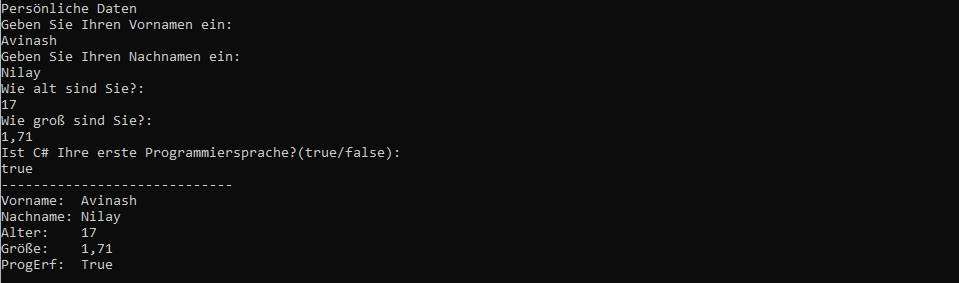

  

        
  

  
 
        <h1>C#-Grundlagen</h1>
        <h3>Arbeitsauftrag zur Konsoleneingabe und Konvertierung</h3>

## :dart: Zielsetzung

Dieser Auftrag hat folgende Ziele:

+ Einfache Programmierprobleme nutzen, um die Modul 1 behandelten Themen zu Vertiefen
+ Üben Informationen zu Recherchieren, die nicht explizit in der Aufgabenstellung genannt werden
+ Üben Sie das Erstellen, Klonen und Einreichen von Aufträgen über Visual Studio 2022 und GitHub

##  :school_satchel: Skills

+ Nutzung des Internets, um Informationen oder Formeln zu finden, die zur Lösung von Programmieraufgaben benötigt werden
+ Verwendung von Zuweisungs-Workflow-Schritten

## :bulb: Benötigtes Wissen
+ Konsoleneingabe erzeugen
+ Konsoleneingabe konvertieren und Variablen zuweisen

## :bookmark_tabs: Informationsquelle
Das Informationsmaterial zu Modul 1 finden Sie [hier](./AddFiles/SAS_Eingabe_Info.pdf)

---

### Aufgabe 1: Persönliche Daten

Nutzen Sie den Befehl ['Console.ReadLine()'](https://github.com/GSO-SW/public_content_gso/wiki/Grundlagen-der-Sprache-C%23#225-consolereadline--consoleread) um die persönlichen Daten des Benutzers einzulesen und speichern Sie diese in folgenden Variablen: 

    string vorname;
    string nachname;
    short alter;
    double groesse;
    bool erste_ps;
Gestalten Sie das Programm benutzerfreundlich.

> :information_source: **Hinweise**:exclamation:
> + Beachten Sie, dass Sie die Ausgabe unter der gestrichelten Linie erzeugen müssen; um die Aufgabe zu bestehen
> + Sie müssen die Formatierung im Beispiel genau befolgen, um den Unittest zu bestehen
> + Nutzen Sie Platzhalter um "Vorname:", "Nachname:", "Alter:", "Größe:" und "ProgErf" 10 Stellen Platz zu geben und linksbündig zu fixieren   

Beispiel 1 Ausgabe/Ergebnis:

---
  
### Aufgabe 2: Arbeit einreichen

1. In Visual Studio 2022 das Fenster "Git-Änderungen" aufrufen
2. Eine kurze Beschreibung Ihrer Änderungen in die Textbox eingeben und "commit für alle" klicken
3. Mit dem Pfeil nach oben die Arbeit auf GitHub pushen.
4. Das Repository im Brower aufrufen und aktualisieren um die Änderungen zu bestätigen.
5. Im Pull-Request die Nachricht "Bereit zum Bewerten" hinterlassen, damit Ihre Lehrkraft weiss das Sie fertig sind.

---
  
# :100: Erfolgskriterien
  
+ Eingesetzten Quellcode kommentieren
+ Quellcode schreiben der lesbar ist und mit Hilfe einer logischen Folge das Problem löst
+ Programmausgabe die korrekt, lesbar und richtig formatiert ist 
